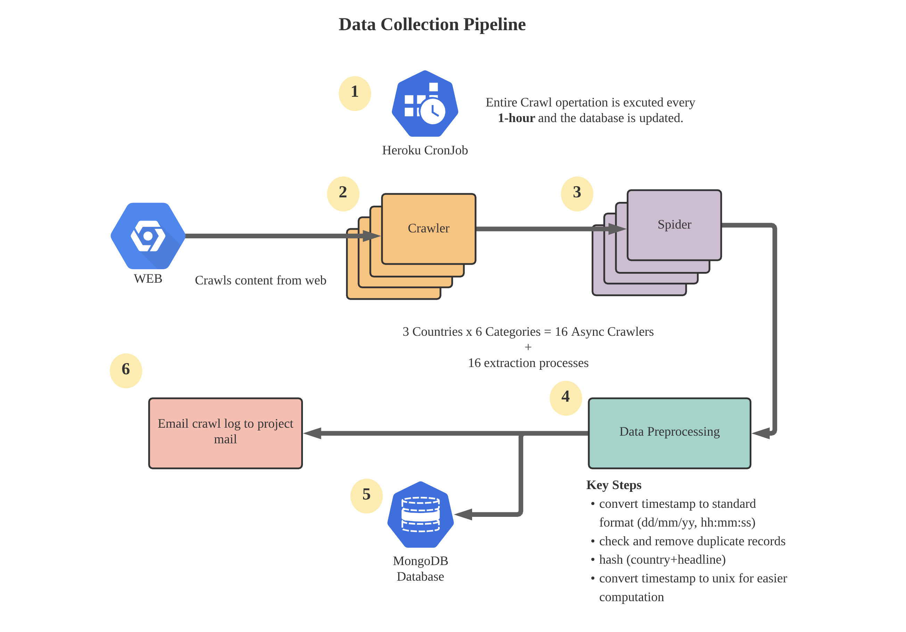

<p align="center">
  
</p>

<p align="center">
  
  
  
  <a href='https://newscastapi.readthedocs.io/en/latest/?badge=latest'>
    
  </a>
</p>

**newscastAPI** is a simple REST API to get you all the news articles for any given query word.

The API provides headlines, source of the articles, published timestamps, urls and various other useful data which potentially has numerous practical use cases such as tracking sentiment of a specific person in news, searching for buzz words and so on.

> **NOTE:** This is an early release of the API, hence certain features are still under development and therefore the performance is not optimised.

The API provides the following data for each news article,

1. Headline
2. Source
3. url to the article
4. published timestamp
5. category
6. country

You can search news articles using the following options:

- **Keywords:** You can search for any news articles which contains the keyword (using exact match).
- **timeperiod** You can specify the time period that you want articles to be published on. For example, search for `trump` from `03-01-2021` to `06-01-2021`. There is also an additional option of choosing how many articles to be returned for each day for any given keyword with in a timeperiod.

<br/>

# **Inspiration**

I have been working on a personal project to track the sentiment of any given word across various news articles and tweets. I needed an API to fetch all the news headlines for any given word and luckily I found quite a lot of alternatives which provided the exact service, but all of them were either expensive or had a lot of restrictions for its usage. So, I thought of building something which does the job at an acceptable performance.

<br/>

# **Usage**

**API:** `https://newscast-api.herokuapp.com/api`

```python
# Python 3.7.9

import requests

# by default, returns the 10 recent news headlines in the database
url = "https://newscast-api.herokuapp.com/api"

response = requests.get(url)
result = response.json()["results"]

# results is a list of dict
print(*result, sep="\n")
```

```js
// node.js
const fetch = require("node-fetch");

fetch("https://newscast-api.herokuapp.com/api", {
  method: "GET",
})
  .then(function (response) {
    return response.json();
  })
  .then(function (data) {
    console.log("Request succeeded with JSON response", data);
  })
  .catch(function (error) {
    console.log("Request failed", error);
  });
```

- Using `query` without `from_date` and `to_date` will fetch today's news about the query, therefore its always best to specify the timeframe. For example,

  `https://newscast-api.herokuapp.com/api?query=ronaldo&from_date=01/01/2021,%2000:00:00&to_date=07/01/2021,%2000:00:00`

  By default, the api only fetchs 10 articles per day about given `query`.

- Using only `from_date` and `to_date` will fetch all the news articles in the given timeframe. For example,

  `https://newscast-api.herokuapp.com/api?from_date=01/01/2021,%2000:00:00&to_date=07/01/2021,%2000:00:00&articles_per_day=100`

<br/>

# **Backend Architecture**

**newscastAPI's** backend is a product of fundamental 2 components,

1. Data collection Pipeline
2. Data serving pipeline

<p align="center">
  
</p>

<p align="center">
  
</p>

<br/>

# **Concurrent Speed Test**

The following tests were ran using the `test_script.py` inside the `scripts` folder.

| Number of concurrent users | Number of calls pre user | Avg Time Taken (seconds) |
| -------------------------- | ------------------------ | ------------------------ |
| 2                          | 5                        | 0.0584594                |
| 10                         | 10                       | 0.28386273               |
| 100                        | 10                       | 2.508303014              |

<br/>

# **To be Implemented**

Will be implementing these features as soon as possible...

- [ ] Implementing caching using redis
- [ ] Top keywords that occurs in news on any given day
- [ ] Search by category
- [ ] Search by country
- [ ] Unit tests
