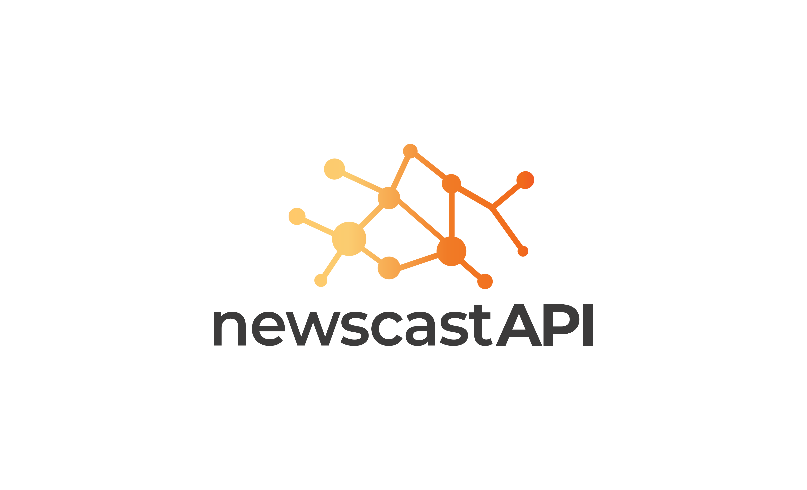

.. Newscast API documentation master file, created by
   sphinx-quickstart on Sun Jan 17 12:51:24 2021.
   You can adapt this file completely to your liking, but it should at least
   contain the root `toctree` directive.

Newscast API Developer Documentation!
========================================

Welcome to the developer documentation for **Newscast API**, a simple REST API to get you all the news articles for any given query word.

**Release:** |release|

**Author:** Siddesh Sambasivam Suseela

**Date:** |today|

.. toctree::
   :maxdepth: 2
   :caption: General Documentation

   getting_started

   usage

   arch

   development

